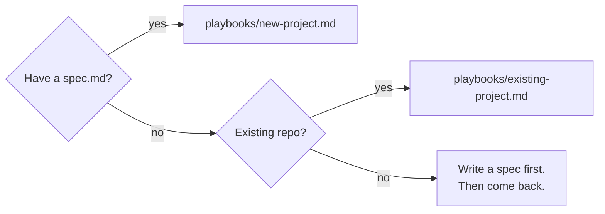

# nexus

[](./LICENSE)
[](https://claude.com/claude-code)
[](#)
[](#)
[](./CONTRIBUTING.md)

> A methodology + template kit for turning any repo into an
> **autonomous beast** — a project that ships itself end-to-end
> through a small set of slash commands, supervises its own
> deploys, observes its own output, and addresses its own
> feedback. From "I drive every commit" to "leave it for 80
> hours and come back to a working product."

This kit is extracted from two real projects (tickpedia, thock)
that operate this way. It is not theory; everything in here was
shipped, broken, and refined in real codebases.

## A single `/march` tick, at a glance

```text
$ /march

  Triage:   0 unlabeled issues — humming on.
  Critique: deferred (4 of 12 commits since last pass).
  Expand:   not due (12 of 20 commits; deliveries first).
  Dispatch: pending phase exists → /ship-a-phase, phase 8.

      1   Read brief, canonical sibling
      2   Build 7 components + 3 helpers
      3   Tests:  12 unit, 2 e2e
      4   pnpm verify   ·  typecheck · test · validate · build · e2e   ✓
      5   Commit + push  (a3f1e2c)
      6   pnpm deploy:check  ·  ready ✓  →  https://thock.netlify.app

  Phase 8 shipped. Next tick picks phase 9.
```

Each tick: one decision, one slice of work, one verify, one
commit, one push, one deploy confirmation. Repeat under `/loop`
for hours or days.

→ [TL;DR — clone + delegate the adoption](#tldr--clone--delegate-the-adoption) (skip the playbook, hand it to your agent)

---

## TL;DR — clone + delegate the adoption

If you'd rather have an agent do the adoption work for you,
clone nexus next to your repo and paste the prompt below into
Claude Code (or Cursor, or any capable agent) at your project's
root.

### 1. Clone

```bash
# Sibling layout — recommended
cd <parent-of-your-project>
git clone https://github.com/<your-fork-or-mirror>/nexus.git nexus
ls
# my-project/   nexus/
```

(If you'd rather submodule it into your repo:
`git submodule add <url> .nexus` and treat `./.nexus` as the
nexus root throughout.)

### 2. Hand it to your agent

Paste this prompt at your project's root (where `git status`
shows your repo):

```
Adopt nexus.

nexus is at ../nexus (or ./.nexus if submoduled). It is a
methodology + template kit for turning this repo into an
autonomous-loop project. Read the following, in order, before
making a single change:

  1. ../nexus/README.md            — entry point
  2. ../nexus/concepts/architecture.md  — the whole system
  3. ../nexus/concepts/skills-anatomy.md — how skills work
  4. ../nexus/playbooks/new-project.md   AND
     ../nexus/playbooks/existing-project.md
                                   — pick the one that applies
  5. ../nexus/playbooks/ci-providers.md  — for the deploy gate
  6. ../nexus/intervention-spectrum.md   — how the loop scales
  7. ../nexus/customization/*.md   — verify gate + data layer
                                     + sub-agents

Then:

  - Decide whether this is greenfield or brownfield by reading
    `git log --oneline | wc -l`, looking at the file tree, and
    checking for an existing spec.md.
  - Follow the matching playbook end-to-end. Do not skip steps.
  - Copy templates from ../nexus/templates/ into this repo.
  - Replace placeholders (<PROJECT>, <PROJECT_LOWER>,
    <HOSTING_URL>, <HOSTING_PROVIDER>, <REPO_SLUG>,
    <DEFAULT_BRANCH>) with values you derive from the existing
    repo state. If a value is genuinely unknowable, surface it
    in plan/AUDIT.md as a [needs-user-call] row and continue
    with a defensible default.
  - Ask the user ONLY for: (a) the hosting provider name and
    auth token if not visibly configured, (b) the project's
    canonical name + tagline if no spec exists, (c) the
    URL/API/CLI contract if it cannot be inferred. For
    everything else, decide.
  - Adapt bearings.md to reflect the actual stack present in
    this repo. Do not assume Next.js, Tailwind, or any
    specific framework — read package.json / Cargo.toml /
    pyproject.toml / go.mod and adapt.
  - Write a build plan with 10–20 phases drawn from the spec
    (or from CURRENT-STATE.md for brownfield). Phase 1 ships
    the nexus overlay itself; phase 2+ are real product work.
  - Wire the verify gate against this repo's actual test
    setup. Wire the deploy gate against the chosen provider.
  - At the end: produce a single commit titled
    "chore: adopt nexus methodology" with a body listing every
    file added/modified, every placeholder you resolved, and
    every [needs-user-call] you logged. Push.
  - Then stop. Do not invoke /ship-a-phase yourself; let the
    user do that as the first conscious step.

Standing rules carried from agents.md:
  - Commit and push as a single atomic act.
  - No Co-Authored-By trailers, no emojis.
  - No --no-verify, no force-push, no destructive resets.
  - Tests alongside code.
  - When in doubt: decide, document the call in the commit body,
    proceed.

Estimated time: 30–90 minutes. Begin.
```

### 3. Review what landed

When the agent returns, expect:

- A new commit titled `chore: adopt nexus methodology`.
- Files added: `agents.md`, `plan/`, `skills/`, `.claude/`,
  `scripts/deploy-check.mjs`, `.env.example`.
- Existing source code: **untouched** (per the playbooks).
- A list of `[needs-user-call]` rows in `plan/AUDIT.md` if the
  agent had to defer any decisions to you.
- A working `pnpm verify` (or stack-equivalent) and
  `pnpm deploy:check`.

Read the diff. Resolve the `[needs-user-call]` rows by editing
the relevant files (or running `/oversight`). Populate `.env`
with your tokens. **Then run `/ship-a-phase` for the first
time** — manually, level 0 of the intervention spectrum. Don't
skip to `/loop /march`.

### When this TL;DR is the wrong path

- Your repo is in active multi-developer flux. Use the manual
  playbook so you can choose what to merge.
- You're skeptical of unattended adoption. Use the playbook —
  read it, do it yourself, develop intuition.
- You want to deeply understand the methodology before
  applying it. Read the concept docs first; come back to the
  TL;DR if it still sounds right.

The TL;DR is for "I trust the methodology, save me the
keystrokes." The playbooks are for everyone else.

---

## What you get

A small family of slash commands the autonomous loop uses:

| Command | Job |
|---|---|
| `/ship-a-phase` | Ship one slice of the build plan end-to-end (code, tests, commit, push). |
| `/ship-data` | Add or repair one record in the GitHub-as-DB (optional — only for projects with structured data). |
| `/plan-a-phase` | Refine the next phase brief without shipping code. |
| `/iterate` | Audit the project, ship one improvement. The post-build endgame. |
| `/critique` | External-observer pass — visit the live site as a stranger, file fresh-eyes findings. |
| `/triage` | Read open GitHub issues, classify, label, route into the address loop. |
| `/expand` | Plan-expansion pass — read signals (audit, critique, spec drift, design landings, data growth) and propose new phase candidates. Posture-gated: **bold** by default, **strict** to opt out. |
| `/march` | Outer dispatcher. The autonomous-beast entry point: triage → critique → phase → data → expand → iterate. |
| `/oversight` | **The only interactive command.** Pause, brief, ask targeted questions, adjust the plan, promote phase candidates. |

Plus specialist sub-agents the main agent delegates to: `scout`
(open-web research), `reader` (live-site observer), and one or two
domain specialists you author for your project.

Two awareness layers wrap every push:
- **Verify gate** (pre-commit, hermetic): typecheck → unit → build → e2e
- **Deploy gate** (post-push, CI/CD-aware): polls your hosting provider until ready or error

Two state files that capture intent across context loss:
- `plan/steps/01_build_plan.md` — at-a-glance status of every phase
- `plan/AUDIT.md` (+ `data/BACKLOG.md` + `plan/CRITIQUE.md`) — queues the loop drains

---

## When this is the right tool

You want this when:

- You have a **definite product** in mind, captured in some form
  of `spec.md`. The methodology assumes you know roughly what
  you're building.
- You're willing to invest **2–4 hours of setup** to get hours
  to days of unattended autonomous build time.
- You can let `main` deploy automatically — the loop assumes
  push = deploy, and gates around that contract.
- You're comfortable having an AI agent decide-and-ship without
  per-commit review. (`/oversight` and the audit logs are how
  you stay honest after the fact.)

You **don't** want this when:

- The product is exploratory, you're discovering as you build,
  and every decision needs human input. (Use the agent
  conversationally instead.)
- The repo has security-critical paths where every commit needs
  human review. (The deploy gate catches regressions, but it's
  not a security review.)
- You have no spec — even a one-pager — to anchor the build
  plan. (Write one first; it's worth a day.)

---

## Two paths to start



### → [`playbooks/new-project.md`](./playbooks/new-project.md)

Greenfield. You have a `spec.md` and an empty (or near-empty)
repo. This walks you through the substrate — bearings, build
plan with placeholder phases, design exports landing pad, the
six skill files — and ends with you running `/ship-a-phase` for
the first time.

### → [`playbooks/existing-project.md`](./playbooks/existing-project.md)

Brownfield. The repo already has code, history, conventions,
maybe even tests. You want to add the autonomous loop on top
without breaking what works. This walks you through the
non-destructive overlay — adding `skills/`, `plan/`, `.claude/`,
and the gates without rewriting the existing app.

### → [`playbooks/ci-providers.md`](./playbooks/ci-providers.md)

The deploy gate is the only piece that varies a lot per project.
This is the matrix: Netlify, Vercel, Fly.io, Cloudflare Pages,
GitHub Pages, Render, self-hosted, and "no deploy yet". For each,
how `pnpm deploy:check` is wired and what state file it polls.

---

## The intervention spectrum

The loop scales from "I drive every step" to "I leave for the
weekend." See [`intervention-spectrum.md`](./intervention-spectrum.md)
for the full ladder; the short version:

| Level | What you do | What the loop does |
|---|---|---|
| **0 — Manual** | Run individual slash commands by hand. Review every diff. | Ships exactly what you ask, one phase at a time. |
| **1 — Supervised** | `/march` once. Review the diff. `/march` again. | One tick at a time, attended. |
| **2 — Loop, attended** | `/loop 30m /march`. Stay around. | Ticks every 30m. You can see deploys, intervene with `/oversight`. |
| **3 — Loop, unattended** | `/loop 30m /march`. Walk away. | Hours of autonomous work. Deploy gate + audit trail keep it honest. |
| **4 — 80-hour beast** | Same. Come back days later. | Phases all shipped, transitioned to `/iterate`. The site iterates itself. |

Levels 3–4 require:
- A green deploy gate is reachable (auth token + hosting wired).
- The build plan has enough phases to chew through without
  running out (or `/iterate` carries the load when phases are
  done).
- `/oversight` works (you'll need it eventually).

Level 4 is where the methodology earns its name. It's also the
hardest to reach — most projects get to level 3 and stay there.

---

## What's in this kit

```
nexus/
├── README.md                          # this file
├── intervention-spectrum.md           # the levels in detail
├── playbooks/
│   ├── new-project.md                 # greenfield setup
│   ├── existing-project.md            # brownfield retrofit
│   └── ci-providers.md                # deploy-gate variations
├── concepts/
│   ├── architecture.md                # the whole system in one read
│   └── skills-anatomy.md              # how to read/write a skill file
├── customization/
│   ├── verify-gate.md                 # composing the right pre-commit checks
│   ├── data-layer.md                  # GitHub-as-DB vs DB vs none
│   └── sub-agents.md                  # designing your specialists
└── templates/
    ├── README.md                      # how to apply the templates
    ├── agents.md                      # rule-book template (target: repo root)
    ├── plan/                          # → repo's plan/
    │   ├── README.md
    │   ├── bearings.md
    │   ├── steps/01_build_plan.md
    │   ├── phases/phase_1_bootstrap.md
    │   ├── phases/phase_canonical_sibling.md
    │   ├── AUDIT.md
    │   └── CRITIQUE.md
    ├── skills/                        # → repo's skills/
    │   ├── ship-a-phase.md
    │   ├── ship-data.md
    │   ├── plan-a-phase.md
    │   ├── iterate.md
    │   ├── critique.md
    │   ├── triage.md
    │   ├── march.md
    │   └── oversight.md
    ├── claude/                        # → repo's .claude/
    │   ├── commands/                  # one terse pointer per skill
    │   └── agents/                    # generic sub-agent templates
    ├── data/                          # → repo's data/ (if using GitHub-as-DB)
    ├── scripts/
    │   └── deploy-check.mjs           # multi-provider deploy gate
    └── env/
        └── env.example                # NETLIFY_AUTH_TOKEN, GH_TOKEN, etc.
```

The templates are the artifacts. Everything else explains how to
adapt them.

---

## How to use this kit

1. **Read this README.** (You're here.)
2. **Read [`concepts/architecture.md`](./concepts/architecture.md)**
   for the one-page mental model.
3. **Decide which playbook applies** — new project or existing.
4. **Read your playbook end-to-end before starting.** It's ~10
   minutes; you'll save hours.
5. **Copy templates into your repo** per the playbook. Replace
   `<PROJECT>` and `<PROJECT_LOWER>` placeholders. Adapt the
   build plan to your real phases.
6. **Wire your CI/CD provider** per
   [`playbooks/ci-providers.md`](./playbooks/ci-providers.md).
7. **Customize** per the docs in `customization/` — pick which
   skills apply, which sub-agents you need, what your verify
   gate looks like.
8. **First invocation: `/ship-a-phase`.** Don't start with
   `/loop /march` — run one phase manually, see the shape of
   the work, then escalate.

---

## What this is *not*

- **Not a code generator.** It's a methodology. The actual code
  is written by the agent during phases. Templates are docs +
  prompts, not source.
- **Not framework-specific.** The skills assume Node + git +
  some test runner. Stack details (Next.js, Django, Rails) live
  in the project's own `bearings.md`, not here.
- **Not a replacement for product thinking.** The autonomous
  loop ships what `spec.md` and `plan/` describe. Garbage in,
  garbage out.
- **Not a substitute for `/oversight`.** The loop drifts. You
  must check in, run `/oversight`, course-correct. The whole
  system is designed around that interaction; don't skip it.

---

## Provenance

This methodology evolved across:

- **tickpedia** (~2025) — A data-heavy site with structured
  records, page families, and weekly automation. Established
  the **`ship-a-phase` + `plan/`** pattern.
- **thock** (~2026) — An editorial content hub. Added
  **`/ship-data`, `/critique`, `/triage`, `/oversight`,
  `/march`** — the full autonomous family.

If you're working with one of those repos, you'll see this kit's
patterns there directly. If you're applying it to a fresh repo,
this kit is the distilled set.

The templates here are **opinionated**: they encode a specific
working style (commit-and-push as one act, no `Co-Authored-By`,
no emojis, hermetic verify gate, post-push deploy gate, audit
trail in commit bodies). Override what doesn't fit your culture
— the bones of the methodology survive plenty of customization.

---

## Hard rules carried across every project

These are baked into every skill template and worth surfacing
upfront:

1. **Commit and push as a single atomic act.** No unpushed
   commits between ticks.
2. **No `Co-Authored-By:` trailers, no emojis** — anywhere.
3. **The verify gate is non-negotiable.** No `--no-verify`. No
   force-push. No destructive resets.
4. **Tests alongside code** — never "add tests later".
5. **The deploy gate runs after every push.** A red deploy is a
   blocked tick.
6. **`AskUserQuestion` is allowed only in `/oversight`.** Every
   other skill decides and ships.

---

## License

This kit is yours to copy, adapt, and use. The templates are
prompts and methodology — there's nothing to license. Use them.

If you build something with it, you don't owe anyone attribution.
If you want to give some back, write up your own variation and
add a link here. The methodology improves with every honest
application.
