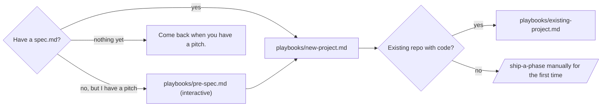

# nexus

Nexus is a methodology + template kit that turns a repo into a
project that ships itself. You write a spec; nexus gives you a
small set of slash commands (`/ship-a-phase`, `/iterate`,
`/critique`, `/triage`, `/march`) that read your spec, ship a
slice, run the verify gate, push, watch the deploy, and
iterate. Run it manually for an evening; let it loop for a
weekend; come back to a working product. Stack-agnostic, AI
client-agnostic, $0 marginal on Claude Pro/Max + a public repo.

[](./LICENSE)
[](https://claude.com/claude-code)
[](#)
[](#)
[](./CONTRIBUTING.md)

> A methodology + template kit for turning any repo into an
> **autonomous beast** — a project that ships itself end-to-end
> through a small set of slash commands, supervises its own
> deploys, observes its own output, and addresses its own
> feedback. From "I drive every commit" to "leave it for 80
> hours and come back to a working product."

This kit is extracted from two real projects (tickpedia, thock)
that operate this way. It is not theory; everything in here was
shipped, broken, and refined in real codebases.

**Run it on your laptop, in the cloud, or both.** The base kit
is local-only — `/loop /march` runs in your Claude Code session.
An opt-in workflow (`playbooks/cloud-loop.md`) puts the same
loop on GitHub Actions for unattended ticks while you're away.
$0 marginal on Claude Pro/Max + a public repo.


## A single `/march` tick, at a glance

```text
$ /march

  Triage:   0 unlabeled issues — humming on.
  Critique: deferred (4 of 12 commits since last pass).
  Expand:   not due (12 of 20 commits; deliveries first).
  Dispatch: pending phase exists → /ship-a-phase, phase 8.

      1   Read brief, canonical sibling
      2   Build 7 components + 3 helpers
      3   Tests:  12 unit, 2 e2e
      4   pnpm verify   ·  typecheck · test · validate · build · e2e   ✓
      5   Commit + push  (a3f1e2c)
      6   pnpm deploy:check  ·  ready ✓  →  https://thock.netlify.app

  Phase 8 shipped. Next tick picks phase 9.
```

Each tick: one decision, one slice of work, one verify, one
commit, one push, one deploy confirmation. Repeat under `/loop`
for hours or days.

→ [TL;DR — clone + delegate the adoption](#tldr--clone--delegate-the-adoption) (skip the playbook, hand it to your agent)
→ [TL;DR — I have a pitch, no spec yet](#tldr--i-have-a-pitch-no-spec-yet) (pre-spec interview, then adoption)

---

## TL;DR — clone + delegate the adoption

> Use this if you already have a `spec.md`. If you only have
> a verbal pitch, jump down to
> [TL;DR — I have a pitch, no spec yet](#tldr--i-have-a-pitch-no-spec-yet).

If you'd rather have an agent do the adoption work for you,
clone nexus next to your repo and paste the prompt below into
Claude Code (or Cursor, or any capable agent) at your project's
root.

### 1. Clone

```bash
# Sibling layout — recommended
cd <parent-of-your-project>
git clone https://github.com/<your-fork-or-mirror>/nexus.git nexus
ls
# my-project/   nexus/
```

(If you'd rather submodule it into your repo:
`git submodule add <url> .nexus` and treat `./.nexus` as the
nexus root throughout.)

### 2. Hand it to your agent

Paste this prompt at your project's root (where `git status`
shows your repo):

```
Adopt nexus.

nexus is at ../nexus (or ./.nexus if submoduled). It is a
methodology + template kit for turning this repo into an
autonomous-loop project. Read the following, in order, before
making a single change:

  1. ../nexus/README.md            — entry point
  2. ../nexus/concepts/architecture.md  — the whole system
  3. ../nexus/concepts/skills-anatomy.md — how skills work
  4. ../nexus/playbooks/new-project.md   AND
     ../nexus/playbooks/existing-project.md
                                   — pick the one that applies
  5. ../nexus/playbooks/ci-providers.md  — for the deploy gate
  6. ../nexus/intervention-spectrum.md   — how the loop scales
  7. ../nexus/customization/*.md   — verify gate + hermetic
                                     e2e + data layer + sub-agents

Then:

  - Decide whether this is greenfield or brownfield by reading
    `git log --oneline | wc -l`, looking at the file tree, and
    checking for an existing spec.md.
  - Follow the matching playbook end-to-end. Do not skip steps.
  - Copy templates from ../nexus/templates/ into this repo.
  - Replace placeholders (<PROJECT>, <PROJECT_LOWER>,
    <PROJECT_TAGLINE>, <HOSTING_URL>, <HOSTING_PROVIDER>,
    <REPO_SLUG>, <DEFAULT_BRANCH>, <PROJECT_PKG_PREFIX>) with
    values you derive from the existing repo state. If a value
    is genuinely unknowable, surface it in plan/AUDIT.md as a
    [needs-user-call] row and continue with a defensible
    default.
  - Ask the user ONLY for: (a) the hosting provider name and
    auth token if not visibly configured, (b) the project's
    canonical name + tagline if no spec exists, (c) the
    URL/API/CLI contract if it cannot be inferred. For
    everything else, decide.
  - Adapt bearings.md to reflect the actual stack present in
    this repo. Do not assume Next.js, Tailwind, or any
    specific framework — read package.json / Cargo.toml /
    pyproject.toml / go.mod and adapt.
  - Write a build plan with 10–20 phases drawn from the spec
    (or from CURRENT-STATE.md for brownfield). Phase 1 ships
    the nexus overlay itself; phase 2+ are real product work.
  - Wire the verify gate against this repo's actual test
    setup. Wire the deploy gate against the chosen provider.
  - At the end: produce a single commit titled
    "chore: adopt nexus methodology" with a body listing every
    file added/modified, every placeholder you resolved, and
    every [needs-user-call] you logged. Push.
  - Then stop. Do not invoke /ship-a-phase yourself; let the
    user do that as the first conscious step.

Standing rules carried from agents.md:
  - Commit and push as a single atomic act.
  - No Co-Authored-By trailers, no emojis.
  - No --no-verify, no force-push, no destructive resets.
  - Tests alongside code.
  - When in doubt: decide, document the call in the commit body,
    proceed.

Estimated time: 30–90 minutes. Begin.
```

### 3. Review what landed

When the agent returns, expect:

- A new commit titled `chore: adopt nexus methodology`.
- Files added: `agents.md`, `CLAUDE.md`, `plan/`, `skills/`,
  `.claude/`, `scripts/deploy-check.mjs`, `.env.example`.
- Existing source code: **untouched** (per the playbooks).
- A list of `[needs-user-call]` rows in `plan/AUDIT.md` if the
  agent had to defer any decisions to you.
- A working `pnpm verify` (or stack-equivalent) and
  `pnpm deploy:check`.

Read the diff. Resolve the `[needs-user-call]` rows by editing
the relevant files (or running `/oversight`). Populate `.env`
with your tokens. **Then run `/ship-a-phase` for the first
time** — manually, level 0 of the intervention spectrum. Don't
skip to `/loop /march`.

### When this TL;DR is the wrong path

- Your repo is in active multi-developer flux. Use the manual
  playbook so you can choose what to merge.
- You're skeptical of unattended adoption. Use the playbook —
  read it, do it yourself, develop intuition.
- You want to deeply understand the methodology before
  applying it. Read the concept docs first; come back to the
  TL;DR if it still sounds right.

The TL;DR is for "I trust the methodology, save me the
keystrokes." The playbooks are for everyone else.

---

## TL;DR — I have a pitch, no spec yet

> Use this if you have a working name and a one-paragraph
> pitch, but no `spec.md` yet. This runs the pre-spec
> interview, writes `spec.md`, and then hands off to the
> adoption flow above. End-to-end in one paste.

Paste this at your project's root (where `git init` has run
but there's nothing else yet):

```
Run nexus's pitch-to-adopted flow.

nexus is at ../nexus (or ./.nexus if submoduled). The plan
is: pre-spec interview → write spec.md → adopt nexus.

Phase A — pre-spec interview (30-45 minutes)

Read ../nexus/playbooks/pre-spec.md end-to-end. Read
../nexus/concepts/asking-well.md for question shape. Then
run the three question batches (foundation, spine, surface)
per the playbook. AskUserQuestion is allowed during this
phase — it's pre-spec, not in-skill. Once spec.md is
committed at the end of Phase A, that rule reverts.

Here's my pitch in my own words:

  <ONE-PARAGRAPH PITCH — what the product is, who it's for,
  what makes it interesting. Don't polish.>

Phase A deliverables (committed before Phase B starts):
  - spec.md (at least one page, persona named, v1 scope)
  - plan/bearings.md stub (Surface, Auth, Stack, hosting,
    voice, hard rules)
  - (optional) claude-design.prompt.md if Batch 3 Q2 landed
    on "commission a visual system" (see
    ../nexus/customization/visual-system.md)
  - (optional) NEXUS_LESSONS.md scratch — capture nexus gaps
    you hit during the interview, for a later /lessons-pr
    pass back to the nexus repo

Phase B — adoption

Once Phase A's commits land, switch to the standard adoption
prompt: read ../nexus/README.md from the TL;DR section
downward, then follow ../nexus/playbooks/new-project.md.
AskUserQuestion is no longer allowed (per nexus's standing
rules — only /oversight may ask). Decide and document; don't
ask.

End-state:
  - chore: adopt nexus methodology commit landed and pushed
  - Day 1 checklist in new-project.md passes
  - Ready for /ship-a-phase as the first conscious step.
  - Do NOT invoke /ship-a-phase yourself; let the user do
    that.

Standing rules:
  - Commit and push as a single atomic act per logical chunk.
  - No Co-Authored-By trailers, no emojis.
  - No --no-verify, no force-push.

Estimated time: 60-90 minutes total. Begin with Phase A.
```

Pitch quality matters. If you can't describe the product in
one paragraph in plain language, come back when you can. The
agent will not invent product direction for you.

---

## What you get

A small family of slash commands the autonomous loop uses:

| Command | Job |
|---|---|
| `/ship-a-phase` | Ship one slice of the build plan end-to-end (code, tests, commit, push). |
| `/ship-data` | Add or repair one record in the GitHub-as-DB (optional — only for projects with structured data). |
| `/ship-migration` | Ship one database migration — additive only, enforced by a linter; destructive changes escalate to `/oversight` (optional — only for `pure-db` / `hybrid-with-managed-postgres` projects). |
| `/plan-a-phase` | Refine the next phase brief without shipping code. |
| `/iterate` | Audit the project, ship one improvement. The post-build endgame. |
| `/critique` | External-observer pass — visit the live site as a stranger, file fresh-eyes findings. |
| `/triage` | Read open GitHub issues, classify, label, route into the address loop. |
| `/expand` | Plan-expansion pass — read signals (audit, critique, spec drift, design landings, data growth) and propose new phase candidates. Posture-gated: **bold** by default, **strict** to opt out. |
| `/march` | Outer dispatcher. The autonomous-beast entry point: triage → critique → phase → data → expand → iterate. |
| `/jot` | **The user's quickfire.** Drop a free-text observation into `plan/CRITIQUE.md` and push, in seconds. The next `/iterate` tick scores it (with a `+0.5` user-source bump) against everything else and ships the fix. No questions back; same shape as `/ship-data add` — input via the slash arg. |
| `/oversight` | **The only interactive command.** Pause, brief, ask targeted questions, adjust the plan, promote phase candidates. |
| `/bootstrap` | **Opt-in executor.** Takes a project from tokens-in to a green deploy + ticking cloud loop by driving provider CLIs (`gh`, `vercel`, `supabase`) and propagating secrets. State-aware, idempotent, never destructive. See [`customization/bootstrap-automation.md`](./customization/bootstrap-automation.md). |

Plus one **opt-in** demand-pull skill for projects with
`Surface: site` / `hybrid` that need to render brand assets
(see [`customization/branding.md`](./customization/branding.md)):

| Opt-in command | Job |
|---|---|
| `/ship-asset` | Render and ship one brand asset (OG image, favicon, social card, SVG → PNG, wordmark variant). Demand-pull only — drains asset findings filed by `/critique`, `/iterate`, or an `/oversight` brand pass. Same shape as `/ship-data`: omit the file if not adopting. |

Plus specialist sub-agents the main agent delegates to: `scout`
(open-web research), `reader` (live-site observer), `brander`
(asset rendering — only present when `/ship-asset` is adopted),
and one or two domain specialists you author for your project.

Two awareness layers wrap every push:
- **Verify gate** (pre-commit, hermetic): typecheck → unit → build → e2e. The e2e leg is the load-bearing piece — see [`customization/hermetic-e2e.md`](./customization/hermetic-e2e.md).
- **Deploy gate** (post-push, CI/CD-aware): polls your hosting provider until ready or error

One enforcement layer (opt-in, for Claude Code runners) turns
the hard rules from promises into walls: a permission
allowlist so unattended ticks never stall on a prompt, guard
hooks that mechanically block `--no-verify` / force-pushes /
backgrounded gates, and a pager so a stopped loop pages your
phone instead of waiting to be discovered. See
[`customization/claude-code.md`](./customization/claude-code.md)
and the walk-away runbook,
[`playbooks/hands-off.md`](./playbooks/hands-off.md).

Two state files that capture intent across context loss:
- `plan/steps/01_build_plan.md` — at-a-glance status of every phase
- `plan/AUDIT.md` (+ `data/BACKLOG.md` + `plan/CRITIQUE.md`) — queues the loop drains

---

## When this is the right tool

You want this when:

- You have a **definite product** in mind, captured in some form
  of `spec.md`. The methodology assumes you know roughly what
  you're building.
- You're willing to invest **2–4 hours of setup** to get hours
  to days of unattended autonomous build time.
- You can let `main` deploy automatically — the loop assumes
  push = deploy, and gates around that contract.
- You're comfortable having an AI agent decide-and-ship without
  per-commit review. (`/oversight` and the audit logs are how
  you stay honest after the fact.)

You **don't** want this when:

- The product is exploratory, you're discovering as you build,
  and every decision needs human input. (Use the agent
  conversationally instead.)
- The repo has security-critical paths where every commit needs
  human review. (The deploy gate catches regressions, but it's
  not a security review.)
- You have no spec — even a one-pager — to anchor the build
  plan. (Write one first; it's worth a day.)

---

## Three paths to start



### → [`playbooks/pre-spec.md`](./playbooks/pre-spec.md)

Have a pitch, no spec yet. A 30-minute interactive interview
that produces `spec.md`, a `bearings.md` stub, and an optional
visual-system commission prompt. The only nexus playbook
where `AskUserQuestion` is allowed — see the carve-out at
the top of the playbook. Output feeds straight into
`new-project.md`.

### → [`playbooks/new-project.md`](./playbooks/new-project.md)

Greenfield. You have a `spec.md` and an empty (or near-empty)
repo. This walks you through the substrate — bearings, build
plan with placeholder phases, design exports landing pad, the
six skill files — and ends with you running `/ship-a-phase` for
the first time.

### → [`playbooks/existing-project.md`](./playbooks/existing-project.md)

Brownfield. The repo already has code, history, conventions,
maybe even tests. You want to add the autonomous loop on top
without breaking what works. This walks you through the
non-destructive overlay — adding `skills/`, `plan/`, `.claude/`,
and the gates without rewriting the existing app.

### → [`playbooks/polyrepo.md`](./playbooks/polyrepo.md) *(variant)*

Outgrown one repo? Once a project has multiple shippable units,
a plan that should stay private while the product is public, or
plan history that shouldn't share a log with product history,
split `plan/` into its own repo with each product a sibling.
Same skills, same state-file shapes — the tick's atomic act
just spans two repos, pushed product-first.

### → [`playbooks/ci-providers.md`](./playbooks/ci-providers.md)

The deploy gate is the only piece that varies a lot per project.
This is the matrix: Netlify, Vercel, Fly.io, Cloudflare Pages,
GitHub Pages, Render, self-hosted, and "no deploy yet". For each,
how `pnpm deploy:check` is wired and what state file it polls.

### → [`playbooks/cloud-loop.md`](./playbooks/cloud-loop.md) *(opt-in)*

Once your local loop is happy, optionally put the same loop on
GitHub Actions so it ticks while your laptop is closed. Three
files, three secrets, one validation run. Defaults to
`github-actions[bot]` author for zero-config setup; opt-in to
your own GitHub identity if you want a uniform git log. **Free
to operate** if your repo is public + you're on Claude Pro/Max.

Don't reach for this until your verify gate is genuinely
hermetic and the local loop has run cleanly for a few days —
the cloud surfaces every flake.

### → [`playbooks/hands-off.md`](./playbooks/hands-off.md)

The walk-away runbook. "Unattended" and "hands-off" are
different claims — this closes the seven silent-death modes
between them: permission walls, silent stops, one bad phase
freezing the beast, drift where nobody's looking, expiring
secrets, budget surprises, and two loops racing one branch.
Ends in a pre-flight checklist and a 24-hour dry run.

### → [`playbooks/recovery.md`](./playbooks/recovery.md)

The incident runbook, written to be read during the incident.
Safe-stop first, one triage tree, then a numbered procedure
per scenario — red deploys, wedged git, churn loops, drift,
outages, expired secrets, corrupted state. Recovery never
force-pushes and never bypasses a gate.

---


## The intervention spectrum

The loop scales from "I drive every step" to "I leave for the
weekend." See [`intervention-spectrum.md`](./intervention-spectrum.md)
for the full ladder; the short version:

| Level | What you do | What the loop does |
|---|---|---|
| **0 — Manual** | Run individual slash commands by hand. Review every diff. | Ships exactly what you ask, one phase at a time. |
| **1 — Supervised** | `/march` once. Review the diff. `/march` again. | One tick at a time, attended. |
| **2 — Loop, attended** | `/loop 30m /march`. Stay around. | Ticks every 30m. You can see deploys, intervene with `/oversight`. |
| **3 — Loop, unattended** | `/loop 30m /march`. Walk away. | Hours of autonomous work. Deploy gate + audit trail keep it honest. |
| **4 — 80-hour beast** | Same. Come back days later. | Phases all shipped, transitioned to `/iterate`. The site iterates itself. |

Levels 3–4 require:
- A green deploy gate is reachable (auth token + hosting wired).
- The build plan has enough phases to chew through without
  running out (or `/iterate` carries the load when phases are
  done).
- `/oversight` works (you'll need it eventually).

Level 4 is where the methodology earns its name. It's also the
hardest to reach — most projects get to level 3 and stay there.

---

## What's in this kit

```
nexus/
├── README.md                          # this file
├── intervention-spectrum.md           # the levels in detail
├── agents.md                          # nexus's OWN rule book (the kit runs on itself)
├── package.json                       # the kit's own verify gate wiring
├── scripts/
│   └── verify.mjs                     # the kit's own gate: links · tree · discover · placeholders · anatomy · emoji
├── playbooks/
│   ├── pre-spec.md                    # pitch → spec.md (interactive)
│   ├── new-project.md                 # greenfield setup
│   ├── existing-project.md            # brownfield retrofit
│   ├── windows-notes.md               # PowerShell twins + Windows hazards page
│   ├── ci-providers.md                # deploy-gate variations
│   ├── cloud-loop.md                  # opt-in GitHub Actions loop
│   ├── hands-off.md                   # the walk-away runbook — close the seven silent-death modes
│   ├── recovery.md                    # the incident runbook — safe-stop, triage tree, procedures
│   └── polyrepo.md                    # variant: plan/ as its own repo + sibling product repos
├── concepts/
│   ├── architecture.md                # the whole system in one read
│   ├── loop-shapes.md                 # the genus: dispatcher, night shift, heartbeat, concierge, pollinator, lanes, meta-loop
│   ├── skills-anatomy.md              # how to read/write a skill file
│   └── asking-well.md                 # the question-shape convention
├── customization/
│   ├── verify-gate.md                 # composing the right pre-commit checks
│   ├── hermetic-e2e.md                # the e2e leg — patterns, alt-port DB seeding, smoke walker
│   ├── data-layer.md                  # gh-as-db / hybrid-with-managed-postgres / pure-db / saas-cms / none
│   ├── sub-agents.md                  # designing your specialists
│   ├── lanes.md                       # alpha/beta/gamma — three agents, one branch (attended fan-out)
│   ├── claude-code.md                 # the Claude Code layer — permissions, guard hooks, pager, model routing
│   ├── branding.md                    # opt-in /ship-asset + brander agent (Surface-gated)
│   ├── visual-system.md               # design system layer (upstream of branding/assets)
│   ├── moderation-loop.md             # mod queues + /oversight escalation (for UGC projects)
│   ├── external-services.md           # the setup/ paradigm — pre-flight every dashboard
│   ├── bootstrap-automation.md        # the executor that drives provider CLIs end-to-end (paired with external-services.md)
│   ├── auth-aware-critique.md         # let /critique walk past a login wall (5 patterns; Auth: in bearings)
│   └── lessons-layer.md               # reflexes + domain-keyed lessons, hard caps, staged-hardening lint
├── skills/                            # nexus's OWN skills — the loop that ships the kit
│   ├── march.md                       # + ship-a-phase, iterate, critique (dry-run adoption),
│   │                                  #   triage, expand, oversight, jot
│   └── lessons-pr.md                  # /lessons-pr — turn a sibling's NEXUS_LESSONS.md into a PR
├── plan/                              # nexus's OWN state files (build plan, queues, briefs)
├── .claude/                           # nexus's OWN commands + settings.json + guard hook
├── .github/                           # nexus's OWN cloud loop (march.yml + CLOUD_LOOP.md)
└── templates/
    ├── README.md                      # how to apply the templates
    ├── agents.md                      # rule-book template (target: repo root)
    ├── design-prompt.md               # paste into a fresh agent to commission a visual system
    ├── plan/                          # → repo's plan/
    │   ├── README.md
    │   ├── bearings.md
    │   ├── steps/01_build_plan.md
    │   ├── phases/phase_1_bootstrap.md
    │   ├── phases/phase_canonical_sibling.md
    │   ├── AUDIT.md
    │   ├── CRITIQUE.md
    │   ├── reflexes.md                # ≤50-line always-read core (adopt-by-need)
    │   └── lessons.md                 # domain-keyed corpus, read by offset (adopt-by-need)
    ├── skills/                        # → repo's skills/
    │   ├── ship-a-phase.md
    │   ├── ship-data.md                # omit if no structured data layer
    │   ├── ship-migration.md           # omit unless Structured data: pure-db / hybrid-with-managed-postgres
    │   ├── ship-asset.md               # omit unless Surface: site / hybrid
    │   ├── moderate.md                 # omit unless UGC (see customization/moderation-loop.md)
    │   ├── plan-a-phase.md
    │   ├── iterate.md
    │   ├── critique.md
    │   ├── triage.md
    │   ├── expand.md
    │   ├── march.md
    │   ├── oversight.md
    │   ├── jot.md                      # user-input quickfire — append a row to plan/CRITIQUE.md
    │   ├── digest.md                   # the night shift — morning briefing + breadth checks
    │   └── bootstrap.md                # opt-in executor (see customization/bootstrap-automation.md)
    ├── claude/                        # → repo's .claude/ (+ CLAUDE.md → repo root)
    │   ├── CLAUDE.md                  # two-line pointer at agents.md
    │   ├── settings.json              # permission allowlist + hook wiring
    │   ├── hooks/guard.mjs            # mechanical hard rules (PreToolUse + Stop)
    │   ├── commands/                  # one terse pointer per skill
    │   └── agents/                    # generic sub-agent templates
    ├── data/                          # → repo's data/ (if using gh-as-db or hybrid)
    ├── setup/                         # → repo's setup/ (per-external-service runbooks)
    │   ├── 00_files.md                # the manifest / index template
    │   ├── NN_service.md              # per-service runbook template
    │   └── bootstrap.example.json     # /bootstrap manifest (copy → bootstrap.local.json)
    ├── .github/                       # → repo's .github/ (opt-in cloud loops)
    │   ├── workflows/march.yml        # the dispatcher: cron + Claude Code Action
    │   ├── workflows/night.yml        # the night shift: /digest + breadth checks
    │   ├── workflows/heartbeat.yml    # the immune system: model-free watchdog
    │   ├── workflows/nightly-smoke.yml # model-free SMOKE_SAMPLE=full walk (omit if night.yml owns breadth)
    │   └── CLOUD_LOOP.md              # operator's guide (lives in repo)
    ├── scripts/
    │   ├── deploy-check.mjs           # multi-provider deploy gate
    │   ├── loop-issue.mjs             # GitHub issue mirror (findings + phases)
    │   ├── notify.mjs                 # the pager — blocked is loud
    │   ├── bootstrap.mjs              # provider-CLI executor (opt-in)
    │   ├── lint-migration.mjs         # additive-migration linter (pairs with ship-migration.md)
    │   ├── refresh-critique-session.mjs # Pattern B session refresh (omit unless Auth: is set)
    │   ├── check-secrets-liveness.mjs # GH_TOKEN + CRITIQUE_* liveness probe (omit unless Auth: is set)
    │   ├── stack-lifecycle.mjs        # Pattern B port/health/state helpers (omit unless hermetic e2e is Pattern B)
    │   └── __tests__/loop-issue.test.mjs # unit tests, node:test, no devDeps
    └── env/
        └── env.example                # NETLIFY_AUTH_TOKEN, GH_TOKEN, NOTIFY_*, etc.
```

The templates are the artifacts. Everything else explains how to
adapt them.

---

## How to use this kit

1. **Read this README.** (You're here.)
2. **Read [`concepts/architecture.md`](./concepts/architecture.md)**
   for the one-page mental model.
3. **Decide which playbook applies** — new project or existing.
4. **Read your playbook end-to-end before starting.** It's ~10
   minutes; you'll save hours.
5. **Copy templates into your repo** per the playbook. Replace
   `<PROJECT>` and `<PROJECT_LOWER>` placeholders. Adapt the
   build plan to your real phases.
6. **Wire your CI/CD provider** per
   [`playbooks/ci-providers.md`](./playbooks/ci-providers.md).
7. **Customize** per the docs in `customization/` — pick which
   skills apply, which sub-agents you need, what your verify
   gate looks like.
8. **First invocation: `/ship-a-phase`.** Don't start with
   `/loop /march` — run one phase manually, see the shape of
   the work, then escalate.

---

## What this is *not*

- **Not a code generator.** It's a methodology. The actual code
  is written by the agent during phases. Templates are docs +
  prompts, not source.
- **Not framework-specific.** The skills assume Node + git +
  some test runner. Stack details (Next.js, Django, Rails) live
  in the project's own `bearings.md`, not here.
- **Not a replacement for product thinking.** The autonomous
  loop ships what `spec.md` and `plan/` describe. Garbage in,
  garbage out.
- **Not a substitute for `/oversight`.** The loop drifts. You
  must check in, run `/oversight`, course-correct. The whole
  system is designed around that interaction; don't skip it.

---

## nexus runs on nexus

This repo eats its own dogfood — it is an adopted nexus
project. The ouroboros, concretely:

- **Its own verify gate.** `node scripts/verify.mjs` — six
  hermetic legs (every relative link resolves, the kit tree
  matches disk, no orphaned doc, placeholder vocabulary
  enforced, skill anatomy enforced, no emojis). On its first
  ever run it caught five real defects in this repo. The gate
  works.
- **Its own plan.** `plan/steps/01_build_plan.md` carries the
  kit's roadmap; `plan/AUDIT.md` and
  `plan/PHASE_CANDIDATES.md` are seeded with real findings
  from deep survey passes — the loop's food.
- **Its own skills.** `skills/` holds the kit's adapted verbs.
  The best one is `/critique`: a **dry-run adoption** — a
  fresh-eyes agent follows this README's TL;DR into a scratch
  directory as a stranger and files every friction point.
- **Its own cloud loops — plural.** The dispatcher
  (`march.yml`) ticks four times a day on Sonnet; the night
  shift (`night.yml`) writes a daily morning briefing to
  `plan/DIGEST.md`; a model-free heartbeat (`heartbeat.yml`)
  watches them both. Label any issue `loop:do` and the next
  tick treats it as a command. The full genus:
  [`concepts/loop-shapes.md`](./concepts/loop-shapes.md);
  operator guide:
  [`.github/CLOUD_LOOP.md`](./.github/CLOUD_LOOP.md).

If you want to see the methodology run before adopting it,
watch this repo's commit log and Issues tab — every phase has
a mirror issue, every cloud commit carries its run URL.

---

## Provenance

This methodology evolved across:

- **tickpedia** (~2025) — A data-heavy site with structured
  records, page families, and weekly automation. Established
  the **`ship-a-phase` + `plan/`** pattern.
- **thock** (~2026) — An editorial content hub. Added
  **`/ship-data`, `/critique`, `/triage`, `/oversight`,
  `/march`** — the full autonomous family.
- **semilayer** (~2026) — A database intelligence layer; the
  proto-nexus ancestor (numbered steps, checkbox roadmap,
  hermetic-e2e doctrine).

If you're working with one of those repos, you'll see this kit's
patterns there directly. If you're applying it to a fresh repo,
this kit is the distilled set.

The templates here are **opinionated**: they encode a specific
working style (commit-and-push as one act, no `Co-Authored-By`,
no emojis, hermetic verify gate, post-push deploy gate, audit
trail in commit bodies). Override what doesn't fit your culture
— the bones of the methodology survive plenty of customization.

---

## Hard rules carried across every project

These are baked into every skill template and worth surfacing
upfront:

1. **Commit and push as a single atomic act.** No unpushed
   commits between ticks.
2. **No `Co-Authored-By:` trailers, no emojis** — anywhere.
3. **The verify gate is non-negotiable.** No `--no-verify`. No
   force-push. No destructive resets.
4. **Tests alongside code** — never "add tests later".
5. **The deploy gate runs after every push.** A red deploy is a
   blocked tick.
6. **`AskUserQuestion` is allowed only in `/oversight`.** Every
   other skill decides and ships.

---

## License

This kit is yours to copy, adapt, and use. The templates are
prompts and methodology — there's nothing to license. Use them.

If you build something with it, you don't owe anyone attribution.
If you want to give some back, write up your own variation and
add a link here. The methodology improves with every honest
application.
