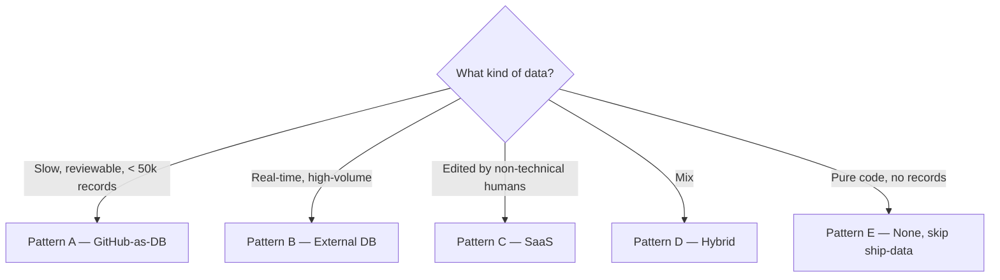

# Customization: data layer

> The `/ship-data` skill is pattern-agnostic; the actual storage
> mechanism varies a lot per project. This doc covers the
> patterns and the cross-cutting **AI-generated vs user-sourced**
> provenance question.

---

## Five patterns

Pick one (or combine) before adopting `/ship-data`. The skill
template doesn't change; the bash commands, validation, and
deploy semantics do.

### Pattern A — GitHub-as-DB (in-repo JSON / YAML / MDX)

**When this fits:**
- Slow-moving structured data the app reads at build time.
- < ~50,000 records (above which the repo bloats).
- Every change is meaningfully reviewable.
- You want hermetic, no-API-key autonomous loops.

**Examples:**
- thock: switches, vendors, group buys, weekly trend snapshots.
- A static documentation site: tutorial steps, API definitions.
- A personal CMS: blog posts in MDX, project pages, photo
  metadata.

**Layout:**
```
data/
├── schemas/                  # JSON Schema (generated)
├── <entity>/<slug>.json
└── <entity>/archive/<slug>.json
```

**Pros:**
- Hermetic. No DB credentials. No external service.
- Diffable. PR review on every record change.
- Versioned. Git history is the audit log.
- Easy backups. The repo IS the backup.

**Cons:**
- Slow at scale. >50k records → repo grows; build time grows.
- No real-time writes. Adding a record = git commit.
- No multi-user concurrent writes. Two people editing the same
  record = merge conflict.

**`/ship-data` shape:**
- Step 4 (Validate): `pnpm data:validate` walks all JSON files.
- Step 6 (Persist + commit): write JSON file, commit, push.
- Step 7 (Confirm deploy): rebuild reflects new data.

### Pattern B — External DB (Postgres / MySQL / SQLite / Mongo / DynamoDB / Firebase)

**When this fits:**
- Real-time writes.
- High volume (>50k records).
- Multi-user concurrent writes.
- App is server-side rendered or has a runtime API.

**Examples:**
- A SaaS product with user accounts.
- A content site that lets users submit corrections.
- An e-commerce platform with inventory.

**Auth:**
- Connection string in `.env` (`DATABASE_URL`, `MONGO_URI`, etc.).
- For Firebase: service account JSON.

**`/ship-data` shape:**
- Step 4 (Validate): driver-level (Drizzle / Prisma / direct
  SQL) inside a transaction. Rollback on failure.
- Step 6 (Persist + commit): record is in DB; commit captures
  the **migration or schema change**:
  ```bash
  git add migrations/<timestamp>_<name>.sql
  git commit -m "data: schema <entity> + insert <slug>

  Record inserted to DB. Migration: <file>.
  DB ID: <id>.
  "
  ```
- Step 7 (Confirm deploy): deploy may not change, but gate runs
  to confirm no regression.

**Pros:**
- Scalable.
- Real-time.
- Standard ops tooling.

**Cons:**
- Not hermetic. Loop needs DB credentials.
- Migration discipline matters. The autonomous loop should NOT
  apply destructive migrations unless explicitly asked.
- Backup hygiene is your problem.

**Migration policy for the autonomous loop:**
- **Allowed**: additive (CREATE TABLE, ADD COLUMN as nullable,
  CREATE INDEX).
- **Stop and ask**: destructive (DROP, ALTER COLUMN narrowing,
  data type changes).

Encode this as a hard rule in `bearings.md`.

### Pattern C — SaaS data store (Airtable / Notion / Sanity / Contentful / Supabase)

**When this fits:**
- You want a CMS / structured-data UI for non-technical users.
- The data is edited by humans more than by the loop.
- The provider has a real API.

**Examples:**
- A blog where editors use Contentful to publish.
- A directory site with Airtable as the back office.
- A team wiki built on Notion.

**Auth:**
- API key in `.env`.
- Provider-specific (Sanity tokens, Airtable PATs, Notion
  integrations).

**`/ship-data` shape:**
- Step 4 (Validate): provider's validation if available; else
  validate locally before posting.
- Step 6 (Persist + commit): record is in the SaaS. Commit a
  **sync log entry**:
  ```bash
  git add data/sync-log.md
  git commit -m "data: synced <entity> <slug> to <provider>

  External ID: <id>.
  "
  ```

**Pros:**
- UI for non-technical users.
- Provider handles uptime + backups.
- Concurrent edits managed by provider.

**Cons:**
- Vendor lock-in.
- Rate limits.
- Pricing scales.
- Loop needs auth.

### Pattern D — Hybrid (some in-repo, some external)

**When this fits:**
- Small slow-changing data (design tokens, vendor list, FAQ) is
  natural in-repo.
- High-volume data (user-submitted, transactional) needs DB.
- You want the best of both.

**Examples:**
- thock-like editorial: articles in MDX-in-repo, comments (if
  added) in a DB.
- A SaaS dashboard: tutorial content in MDX, customer data in
  Postgres.

**`/ship-data` shape:**
- Per-entity routing. The skill checks the schema's `pattern`
  marker and runs the matching flow.

```
data/
├── schemas/
│   ├── <repo-entity>.schema.json    # pattern: A
│   └── <db-entity>.schema.json      # pattern: B
├── <repo-entity>/<slug>.json
└── sync-log.md                       # for B-pattern entities
```

**Pros:** flexibility.
**Cons:** complexity. Document clearly in `bearings.md` which
entities are which.

### Pattern E — None

**When this fits:**
- The project is a pure code library (npm package, Cargo crate).
- The project is a CLI without persistent state.
- The project is a single-page tool with no backend data.

**Examples:**
- A linter rule package.
- A code-formatting CLI.
- A static landing page.

**Action:**
- **Delete** `skills/ship-data.md` and
  `.claude/commands/ship-data.md`.
- Delete `data/` entirely.
- `/march` handles the absence.

---

## Provenance — AI-generated vs user-sourced

This dimension cuts across all five patterns. It's about
**trust and attribution**, not storage.

Every record (regardless of pattern) carries a provenance block:

```json
{
  ...fields...,
  "provenance": {
    "source": "scout" | "user" | "ai-generated" | "vendor-published" | "manual-import",
    "verified": true | false,
    "verified_by": "<actor>" | null,
    "verified_at": "<ISO date>" | null,
    "citations": [<url-or-source-id>, ...]
  }
}
```

For Pattern B (DB), this is a column or sub-document. For
Pattern C (SaaS), this is a field group. For Pattern A
(in-repo), this is part of the JSON.

### Source taxonomy

| Source | Meaning | Verification | Citations |
|---|---|---|---|
| `vendor-published` | Manufacturer / authoritative source's own publication | None (trust source) | URL to vendor page required |
| `user` | User-submitted (form, API endpoint, GitHub issue) | Shape + spam filter | Optional |
| `scout` | Open-web research by the scout sub-agent | Cross-source confirmation if claim is high-stakes | Required, ≥1 primary source |
| `ai-generated` | LLM-drafted prose / summary / description | Factual claims must be cite-backed | Required for factual; not for editorial opinion |
| `manual-import` | You, by hand | Trust your own | Optional |

### The AI-generated rigor

**`ai-generated` records require extra discipline.** When the
loop produces an AI-generated record (typically a content
record — article, summary, description):

1. **Every factual claim must trace to a citation.** If a claim
   can't be cited, remove it or mark clearly as opinion.
2. **Spawn `scout` to verify before publish.** `verified` flag
   stays `false` until scout confirms.
3. **Records published `verified: false` are visible but
   flagged** — `[draft]` badge, `noindex` meta, or "review
   pending" treatment per project taste. Next `/iterate` tick
   prioritizes verifying them.

### When `verified: false` is OK to ship

The loop should ship `verified: false` records (rather than
withholding) when:

- The unverified record is **low-stakes** — minor description,
  not a load-bearing fact.
- The UI **flags it visibly** to readers ("This entry is
  awaiting fact-check").
- A queue of unverified records is **bounded** (e.g., max 5%
  of total) — beyond that, the loop must verify before adding
  more.

The loop should **not** ship `verified: false` records when:

- The fact is high-stakes (price, availability, safety claim).
- The publication has an editorial reputation that's harmed by
  unverified content.
- Verification is cheap and the loop is just being lazy.

### User-sourced rigor (different shape)

User-submitted records have a different threat model:

- **Spam / promotion:** filter via simple heuristics
  (link density, off-topic, vendor self-promotion).
- **Wrong shape:** schema validation catches.
- **Conflict of interest:** when a vendor submits about their
  own product. Mark `source: user` with metadata field
  `submitter_role: vendor` and treat as `ai-generated`-grade
  rigor (cite-backed only).
- **Timing attacks:** rate-limit submissions per user / per IP.

The loop should not autonomously **publish** user-submitted
records to public surfaces without one of:

1. A trust score reaching threshold (user has prior verified
   contributions).
2. Manual approval (a `triage:loop-queued` GitHub issue, with
   the user's submitted record in the body, that an editor
   reviews).
3. A "user contributions" section visually distinct from
   editorial content.

Encode the chosen flow in `bearings.md` Standing Decisions.

### Provenance schema (Zod)

```ts
// <schema-package>/src/schemas/provenance.ts
import { z } from 'zod'

export const ProvenanceSchema = z.object({
  source: z.enum([
    'scout',
    'user',
    'ai-generated',
    'vendor-published',
    'manual-import',
  ]),
  verified: z.boolean(),
  verified_by: z.string().nullable(),
  verified_at: z.string().datetime().nullable(),
  citations: z.array(z.string().url()),
  // optional metadata fields
  submitter_role: z.enum(['author', 'editor', 'vendor', 'reader']).optional(),
  ai_model: z.string().optional(),                        // e.g. "claude-opus-4.7"
  generated_at: z.string().datetime().optional(),
}).refine(
  (p) => p.source !== 'ai-generated' || p.citations.length >= 1,
  { message: 'ai-generated records require ≥1 citation for factual claims' },
).refine(
  (p) => !p.verified || (p.verified_by && p.verified_at),
  { message: 'verified records must have verified_by and verified_at' },
)
```

Refine-rule the schema by source. Every record's schema does:

```ts
export const SwitchSchema = z.object({
  // ...switch fields...
  provenance: ProvenanceSchema,
})
```

For Pattern B / C, this is enforced at the driver / API
boundary; for Pattern A, by `pnpm data:validate`.

---

## How to choose



If unsure: **start with Pattern A and see how far it goes.**
The migration to Pattern B/C is straightforward when scale
demands it; the reverse (DB → JSON-in-repo) is harder.

---

## Migrating between patterns

### A → B (GitHub-as-DB to external DB)

Triggered when: repo growing >50k records, build times suffering,
multi-user writes needed.

1. Define the DB schema mirroring the Zod schemas.
2. Write a migration script that reads `data/<entity>/*.json`
   and inserts into the DB.
3. Update `<schema-package>` loaders to read from DB instead of
   filesystem.
4. Keep `data/` for one or two releases as the audit trail; then
   `git mv data/ data-archive/`.
5. Update `bearings.md` and `customization/data-layer.md` (this
   file) to reflect Pattern B.
6. Update `.env` with DB credentials.
7. Update `skills/ship-data.md` Step 6 (commit captures
   migration, not record file).

This is a deliberate phase, not an iterate finding. Use
`/plan-a-phase` to write the migration brief.

### B → C (DB to SaaS)

Less common. Triggered when: editors want a UI, you want to
shed ops burden.

1. Pick the SaaS provider.
2. Map your schema to the provider's content model.
3. Write export-from-DB / import-to-SaaS scripts.
4. Switch loaders to read from SaaS.
5. Decommission the DB.

Same: deliberate phase via `/plan-a-phase`.

### Any → A (consolidating to in-repo)

Less common; usually wrong direction. Only do this if you're
shrinking scope dramatically.
