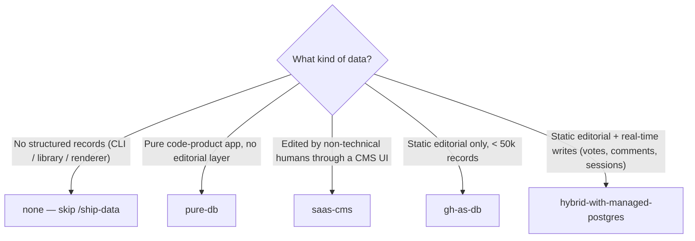

# Customization: data layer

> The `/ship-data` skill is pattern-agnostic; the actual storage
> mechanism varies a lot per project. This doc covers the
> patterns and the cross-cutting **AI-generated vs user-sourced**
> provenance question.

---

## Five named variants

Pick one (or combine) before adopting `/ship-data`. Each
variant has a short slug — `gh-as-db`, `hybrid-with-managed-postgres`,
`pure-db`, `saas-cms`, `none` — that
[`templates/plan/bearings.md`](../templates/plan/bearings.md)
references in its "Structured data" row. Skills read the
slug; the bash commands, validation, and deploy semantics
follow from there.

| Slug | When to pick | Skills affected |
|---|---|---|
| `none` | Pure code, no records. CLI, library, renderer. | none — delete `/ship-data`. |
| `gh-as-db` | Read-heavy, edit-light, ≤ ~50k records, every change reviewable. | `/ship-data` markdown shape. |
| `hybrid-with-managed-postgres` | Static editorial in repo + managed Postgres for write-heavy dynamic (votes, comments, sessions, real-time). | `/ship-data` (static) + `/ship-migration` (DB schema). |
| `pure-db` | Everything in DB; repo is code only. App-like. | `/ship-migration` only. |
| `saas-cms` | Edited by non-technical humans through a CMS UI (Sanity, Contentful, Notion, Airtable). | `/ship-data` sync-log shape. |

Pattern A (`gh-as-db`) is the recommended starting point for
new editorial projects — easy to wrap your head around, no
external credentials, the repo is the audit log. Pattern C
(`hybrid-with-managed-postgres`) is the recommended starting
point for projects with **any** real-time write surface
(voting, comments, presence, sessions): it accommodates
those without forcing every record into the DB.

### Pattern A — `gh-as-db` (GitHub-as-DB)

**When this fits:**
- Slow-moving structured data the app reads at build time.
- < ~50,000 records (above which the repo bloats).
- Every change is meaningfully reviewable.
- You want hermetic, no-API-key autonomous loops.

**Examples:**
- thock: switches, vendors, group buys, weekly trend snapshots.
- A static documentation site: tutorial steps, API definitions.
- A personal CMS: blog posts in MDX, project pages, photo
  metadata.

**Layout:**
```
data/
├── schemas/                  # JSON Schema (generated)
├── <entity>/<slug>.json
└── <entity>/archive/<slug>.json
```

**Pros:**
- Hermetic. No DB credentials. No external service.
- Diffable. PR review on every record change.
- Versioned. Git history is the audit log.
- Easy backups. The repo IS the backup.

**Cons:**
- Slow at scale. >50k records → repo grows; build time grows.
- No real-time writes. Adding a record = git commit.
- No multi-user concurrent writes. Two people editing the same
  record = merge conflict.

**`/ship-data` shape:**
- Step 4 (Validate): `pnpm data:validate` walks all JSON files.
- Step 6 (Persist + commit): write JSON file, commit, push.
- Step 7 (Confirm deploy): rebuild reflects new data.

### Pattern B — `pure-db` (everything in an external DB)

> Slug: `pure-db`. The project's structured data lives
> entirely in a database; the repo is code + migrations
> only. Common shape for app-like projects without a
> meaningful editorial layer.

**Provider examples:** Managed Postgres (Supabase, Neon,
Turso, PlanetScale, Render Postgres, Fly Postgres) — these
are interchangeable. Also MySQL, SQLite, Mongo, DynamoDB,
Firebase. The skill text references `$DB_PROVIDER` from
bearings; the provider is configuration, not a pin.

**When this fits:**
- Real-time writes.
- High volume (>50k records).
- Multi-user concurrent writes.
- App is server-side rendered or has a runtime API.
- The product has no meaningful editorial / static layer.

**Examples:**
- A SaaS product with user accounts.
- A content site that lets users submit corrections.
- An e-commerce platform with inventory.

**Auth:**
- Connection string in `.env` (`DATABASE_URL`, `MONGO_URI`, etc.).
- For Firebase: service account JSON.

**`/ship-data` shape:**
- Step 4 (Validate): driver-level (Drizzle / Prisma / direct
  SQL) inside a transaction. Rollback on failure.
- Step 6 (Persist + commit): record is in DB; commit captures
  the **migration or schema change**:
  ```bash
  git add migrations/<timestamp>_<name>.sql
  git commit -m "data: schema <entity> + insert <slug>

  Record inserted to DB. Migration: <file>.
  DB ID: <id>.
  "
  ```
- Step 7 (Confirm deploy): deploy may not change, but gate runs
  to confirm no regression.

**Pros:**
- Scalable.
- Real-time.
- Standard ops tooling.

**Cons:**
- Not hermetic. Loop needs DB credentials.
- Migration discipline matters. The autonomous loop should NOT
  apply destructive migrations unless explicitly asked.
- Backup hygiene is your problem.

**Migration policy for the autonomous loop:**
- **Allowed**: additive (CREATE TABLE, ADD COLUMN as nullable,
  CREATE INDEX).
- **Stop and ask**: destructive (DROP, ALTER COLUMN narrowing,
  data type changes).

Encode this as a hard rule in `bearings.md`. Ship migrations
through
[`templates/skills/ship-migration.md`](../templates/skills/ship-migration.md);
[`templates/scripts/lint-migration.mjs`](../templates/scripts/lint-migration.mjs)
enforces the additive-only half mechanically — see "Migration
safety" under Pattern D below.

### Pattern C — `saas-cms` (managed CMS / SaaS data store)

**When this fits:**
- You want a CMS / structured-data UI for non-technical users.
- The data is edited by humans more than by the loop.
- The provider has a real API.

**Examples:**
- A blog where editors use Contentful to publish.
- A directory site with Airtable as the back office.
- A team wiki built on Notion.

**Auth:**
- API key in `.env`.
- Provider-specific (Sanity tokens, Airtable PATs, Notion
  integrations).

**`/ship-data` shape:**
- Step 4 (Validate): provider's validation if available; else
  validate locally before posting.
- Step 6 (Persist + commit): record is in the SaaS. Commit a
  **sync log entry**:
  ```bash
  git add data/sync-log.md
  git commit -m "data: synced <entity> <slug> to <provider>

  External ID: <id>.
  "
  ```

**Pros:**
- UI for non-technical users.
- Provider handles uptime + backups.
- Concurrent edits managed by provider.

**Cons:**
- Vendor lock-in.
- Rate limits.
- Pricing scales.
- Loop needs auth.

### Pattern D — `hybrid-with-managed-postgres` (static editorial + managed Postgres)

> Slug: `hybrid-with-managed-postgres`. The project's most
> natural shape for anything with a real-time write surface
> (voting, comments, sessions, presence) on top of an
> editorial spine. Most modern editorial sites with UGC end
> up here.

**Provider examples:** Supabase, Neon, Turso, PlanetScale,
Render Postgres, Fly Postgres, AWS RDS, Cloudflare D1 — all
interchangeable instances of "managed Postgres or
Postgres-compatible." The skill text references
`$DB_PROVIDER` from bearings; pick the one your team knows.
The methodology pins none of them.

**When this fits:**
- Static editorial content is natural in-repo (articles,
  schedules, vendor lists, design tokens, FAQ).
- High-volume dynamic data needs real-time writes (votes,
  comments, sessions, presence, telemetry).
- You want hermetic local dev for the static side AND
  managed ops for the dynamic side.
- The product has both editorial cadence *and* user-state.

**Examples:**
- An editorial site with votes + comments — static articles
  in MDX, votes in Postgres.
- A SaaS dashboard — tutorial content in MDX, customer
  records in Postgres.
- An events site — event metadata in MDX, RSVPs / check-ins
  in Postgres.

**Auth:**
- Managed-Postgres connection string + service-role key in
  `.env`.
- Public anon key in `NEXT_PUBLIC_*` (or framework
  equivalent) for client-side queries.
- The auth provider (if separate from the DB provider) gets
  its own runbook under `setup/`; see
  [`./external-services.md`](./external-services.md).

**Layout:**
```
<repo>/
├── content/                          # static editorial (Pattern A shape)
│   ├── articles/<slug>.mdx
│   └── ...
├── data/                             # static structured records (Pattern A shape)
│   ├── schemas/
│   └── <entity>/<slug>.json
└── supabase/                         # OR neon/, turso/, etc.
    ├── migrations/
    │   ├── 0001_initial.sql
    │   ├── 0002_votes_table.sql
    │   └── 0003_rls_policies.sql
    ├── seed.sql                       # local dev seed
    └── tests/
        └── rls.test.sql               # RLS policy tests
```

**`/ship-data` shape (for the static side):**
- Identical to Pattern A (`gh-as-db`). Static records ship
  through markdown / JSON commits.

**`/ship-migration` shape (for the dynamic side):**
- Companion skill:
  [`templates/skills/ship-migration.md`](../templates/skills/ship-migration.md) —
  same shape as `/ship-data`: one phase = one migration +
  its RLS policies + its rollback note + its tests.
- Per tick:
  1. Read pending migration brief (from
     `data/BACKLOG.md` or a phase brief).
  2. Write `supabase/migrations/NNNN_<name>.sql`.
  3. Write the matching RLS policies in the same file (or
     a sibling `NNNN_<name>_rls.sql`).
  4. Write the rollback as a comment block at the top.
  5. Write the test that proves the RLS policy keeps the
     wrong actors out (see "RLS testing" below).
  6. Run `pnpm db:migrate:test` against a throwaway local
     DB (Docker container or local Postgres) — verify the
     migration applies cleanly and the RLS test passes.
  7. Run `pnpm verify` — typecheck + unit + build + e2e
     against the local DB.
  8. Commit + push. The push triggers the deploy gate.
  9. **Migration is applied to production by the
     deploy provider, not by the loop.** The loop does
     not hold production DB credentials by default. See
     "Migration safety" below.

**Sub-agent:**
- A new `data-steward` sub-agent with Postgres expertise
  (RLS policy design, index selection, anti-brigade vote-
  weighting math). See
  [`./sub-agents.md`](./sub-agents.md) §`data-steward`.
  Spawned by `/ship-migration` for schema-design subtasks.

**Bearings additions (see
[`../templates/plan/bearings.md`](../templates/plan/bearings.md)):**
- `Auth provider` — pinned at bootstrap.
- `DB provider` — `<DB_PROVIDER>` (Supabase / Neon / …).
- `RLS posture` — strict / permissive / per-table.
- `Anti-abuse limits` — vote weight cap, comment
  rate-limit per user/hour, IP-hash retention window.

**`/critique` and `/iterate` extensions:**
- Both skills must know to read **DB state**, not just
  files. The default templates are file-only. For this
  variant, the audit pass includes:
  > **DB hygiene.** Connect read-only to the configured
  > `$DATABASE_URL`. Count rows per table; flag tables
  > growing > N rows/day. Spot-check RLS policies are
  > present on every table. Walk the index list; flag any
  > sequential-scan-prone query patterns the audit caught
  > in the logs.
- Pin the audit to read-only credentials. Loop never has
  schema-mutation power outside `/ship-migration`.

**Migration safety:**

The autonomous loop ships migrations through commits, but
**applying** migrations to production is gated by the
deploy provider's migration pipeline (Supabase's
migrations runner, a custom GitHub Action, Sqitch, or
similar). The loop does not hold production DB credentials
by default.

- **Allowed** through the loop: additive migrations
  (CREATE TABLE, ADD COLUMN as nullable, CREATE INDEX,
  CREATE POLICY).
- **Stop and ask via `/oversight`**: destructive
  migrations (DROP, ALTER COLUMN narrowing, data type
  changes, RLS posture downgrades).

[`templates/scripts/lint-migration.mjs`](../templates/scripts/lint-migration.mjs)
is the mechanical enforcement: `/ship-migration` Step 6 runs it
against every migration file and blocks the commit on a
destructive finding, rather than trusting the loop to remember
the rule.

Encode this as a hard rule in `bearings.md`:

> The autonomous loop applies additive migrations only.
> Destructive migrations require `/oversight` approval
> and a tested rollback plan before merge.

**RLS testing — the load-bearing piece:**

Row-Level Security policies are easy to write wrong and
catastrophic when they're wrong. Test every policy:

```sql
-- supabase/tests/votes_rls.test.sql
begin;
select plan(3);

-- as anon: can read public votes, cannot insert
set role anon;
select results_eq(
  $$ select count(*) from votes where season_id = 'abc' $$,
  $$ select 0::bigint $$,
  'anon sees public votes (zero in seed)'
);
select throws_ok(
  $$ insert into votes (user_id, season_id, weight)
     values (null, 'abc', 1) $$,
  '42501',
  'anon cannot insert votes'
);

-- as authenticated: can insert own vote
set role authenticated;
set request.jwt.claim.sub = 'user-uuid-1';
select lives_ok(
  $$ insert into votes (user_id, season_id, weight)
     values ('user-uuid-1', 'abc', 1) $$,
  'authenticated user can vote'
);

select * from finish();
rollback;
```

The RLS test runs in `pnpm verify` (db:test leg) and in
CI before merge. A migration without an RLS test for every
new policy is a `/ship-migration` failure.

**Pros:**
- Static side keeps editorial cadence + diffable history.
- Dynamic side handles real-time + multi-user concurrent
  writes.
- Each entity lives in the storage that fits its access
  pattern — no forcing.
- Local dev stays hermetic for the static side (most of
  the project); only the DB-touching subset needs DB
  credentials.

**Cons:**
- Two storage models to operate. `bearings.md` must
  clearly list which entities are which.
- The verify gate gains a DB leg; CI gains a DB step.
- Migration discipline matters — see "Migration safety."

### Pattern E — `none`

**When this fits:**
- The project is a pure code library (npm package, Cargo crate).
- The project is a CLI without persistent state.
- The project is a single-page tool with no backend data.

**Examples:**
- A linter rule package.
- A code-formatting CLI.
- A static landing page.

**Action:**
- **Delete** `skills/ship-data.md` and
  `.claude/commands/ship-data.md`.
- Delete `data/` entirely.
- `/march` handles the absence.

---

## Provenance — AI-generated vs user-sourced

This dimension cuts across all five patterns. It's about
**trust and attribution**, not storage.

Every record (regardless of pattern) carries a provenance block:

```json
{
  ...fields...,
  "provenance": {
    "source": "scout" | "user" | "ai-generated" | "vendor-published" | "manual-import",
    "verified": true | false,
    "verified_by": "<actor>" | null,
    "verified_at": "<ISO date>" | null,
    "citations": [<url-or-source-id>, ...]
  }
}
```

For `pure-db` / the DB-side of
`hybrid-with-managed-postgres`, this is a column (or JSONB
sub-document). For `saas-cms`, this is a field group. For
`gh-as-db` / the static side of
`hybrid-with-managed-postgres`, this is part of the JSON
file itself.

### Source taxonomy

| Source | Meaning | Verification | Citations |
|---|---|---|---|
| `vendor-published` | Manufacturer / authoritative source's own publication | None (trust source) | URL to vendor page required |
| `user` | User-submitted (form, API endpoint, GitHub issue) | Shape + spam filter | Optional |
| `scout` | Open-web research by the scout sub-agent | Cross-source confirmation if claim is high-stakes | Required, ≥1 primary source |
| `ai-generated` | LLM-drafted prose / summary / description | Factual claims must be cite-backed | Required for factual; not for editorial opinion |
| `manual-import` | You, by hand | Trust your own | Optional |

### The AI-generated rigor

**`ai-generated` records require extra discipline.** When the
loop produces an AI-generated record (typically a content
record — article, summary, description):

1. **Every factual claim must trace to a citation.** If a claim
   can't be cited, remove it or mark clearly as opinion.
2. **Spawn `scout` to verify before publish.** `verified` flag
   stays `false` until scout confirms.
3. **Records published `verified: false` are visible but
   flagged** — `[draft]` badge, `noindex` meta, or "review
   pending" treatment per project taste. Next `/iterate` tick
   prioritizes verifying them.

### When `verified: false` is OK to ship

The loop should ship `verified: false` records (rather than
withholding) when:

- The unverified record is **low-stakes** — minor description,
  not a load-bearing fact.
- The UI **flags it visibly** to readers ("This entry is
  awaiting fact-check").
- A queue of unverified records is **bounded** (e.g., max 5%
  of total) — beyond that, the loop must verify before adding
  more.

The loop should **not** ship `verified: false` records when:

- The fact is high-stakes (price, availability, safety claim).
- The publication has an editorial reputation that's harmed by
  unverified content.
- Verification is cheap and the loop is just being lazy.

### User-sourced rigor (different shape)

User-submitted records have a different threat model:

- **Spam / promotion:** filter via simple heuristics
  (link density, off-topic, vendor self-promotion).
- **Wrong shape:** schema validation catches.
- **Conflict of interest:** when a vendor submits about their
  own product. Mark `source: user` with metadata field
  `submitter_role: vendor` and treat as `ai-generated`-grade
  rigor (cite-backed only).
- **Timing attacks:** rate-limit submissions per user / per IP.

The loop should not autonomously **publish** user-submitted
records to public surfaces without one of:

1. A trust score reaching threshold (user has prior verified
   contributions).
2. Manual approval (a `triage:loop-queued` GitHub issue, with
   the user's submitted record in the body, that an editor
   reviews).
3. A "user contributions" section visually distinct from
   editorial content.

Encode the chosen flow in `bearings.md` Standing Decisions.

### Provenance schema (Zod)

```ts
// <schema-package>/src/schemas/provenance.ts
import { z } from 'zod'

export const ProvenanceSchema = z.object({
  source: z.enum([
    'scout',
    'user',
    'ai-generated',
    'vendor-published',
    'manual-import',
  ]),
  verified: z.boolean(),
  verified_by: z.string().nullable(),
  verified_at: z.string().datetime().nullable(),
  citations: z.array(z.string().url()),
  // optional metadata fields
  submitter_role: z.enum(['author', 'editor', 'vendor', 'reader']).optional(),
  ai_model: z.string().optional(),                        // e.g. "claude-opus-4.7"
  generated_at: z.string().datetime().optional(),
}).refine(
  (p) => p.source !== 'ai-generated' || p.citations.length >= 1,
  { message: 'ai-generated records require ≥1 citation for factual claims' },
).refine(
  (p) => !p.verified || (p.verified_by && p.verified_at),
  { message: 'verified records must have verified_by and verified_at' },
)
```

Refine-rule the schema by source. Every record's schema does:

```ts
export const SwitchSchema = z.object({
  // ...switch fields...
  provenance: ProvenanceSchema,
})
```

For `pure-db` / `saas-cms`, this is enforced at the
driver / API boundary; for `gh-as-db`, by
`pnpm data:validate`; for `hybrid-with-managed-postgres`,
both — at the driver for DB-side records, at
`pnpm data:validate` for static records.

---

## How to choose



If unsure between `gh-as-db` and
`hybrid-with-managed-postgres`: pick
`hybrid-with-managed-postgres` if the v1 spec mentions
*any* real-time write surface (voting, comments, presence,
sessions, telemetry). Otherwise pick `gh-as-db`.

The migration from `gh-as-db` to
`hybrid-with-managed-postgres` is straightforward when scale
demands; the reverse (DB → JSON-in-repo) is harder. The
migration from any pattern to `none` is destructive — only
do it if you're shrinking scope dramatically.

---

## Migrating between variants

### `gh-as-db` → `hybrid-with-managed-postgres`

Triggered when: a new write-heavy surface lands (voting,
comments, sessions) and the in-repo shape can't accommodate
real-time / multi-user.

1. Pick a managed Postgres provider (Supabase, Neon, Turso,
   …). Write the `setup/NN_<db>.md` runbook per
   [`./external-services.md`](./external-services.md)
   *before* the first migration ships.
2. Define the DB schema for the new dynamic entities only —
   don't migrate the static side.
3. Write the first migration + RLS policy + RLS test under
   `supabase/migrations/` (or `<db>/migrations/`).
4. Add `data-steward` sub-agent (see
   [`./sub-agents.md`](./sub-agents.md)).
5. Update `bearings.md`: change `Structured data` row from
   `gh-as-db` to `hybrid-with-managed-postgres`. Add the new
   bearings rows (`Auth provider`, `DB provider`, `RLS
   posture`, `Anti-abuse limits`).
6. Add a new `/ship-migration` skill — same shape as
   `/ship-data`. Wire `/march` to dispatch on pending
   migrations.

This is a deliberate phase, not an iterate finding. Use
`/plan-a-phase` to write the migration brief.

### `gh-as-db` → `pure-db`

Triggered when: repo growing >50k records, build times
suffering, every entity benefits from real-time writes.
Rarer; consider `hybrid-with-managed-postgres` first.

1. Define the DB schema mirroring the Zod schemas.
2. Write a migration script that reads `data/<entity>/*.json`
   and inserts into the DB.
3. Update `<schema-package>` loaders to read from DB instead
   of filesystem.
4. Keep `data/` for one or two releases as the audit trail;
   then `git mv data/ data-archive/`.
5. Update `bearings.md` and this file's
   `Structured data` row to `pure-db`.
6. Update `.env` with DB credentials.
7. Replace `/ship-data` with `/ship-migration`.

### `hybrid-with-managed-postgres` → `pure-db`

Rare. Triggered when: the static editorial layer has
collapsed into the DB anyway (records-grew-faster-than-MDX).
Same shape as the previous migration but the static side is
the work.

### `pure-db` → `saas-cms` (DB to SaaS-managed)

Less common. Triggered when: editors want a UI, you want to
shed ops burden.

1. Pick the SaaS provider.
2. Map your schema to the provider's content model.
3. Write export-from-DB / import-to-SaaS scripts.
4. Switch loaders to read from SaaS.
5. Decommission the DB.

Same: deliberate phase via `/plan-a-phase`.

### Any → `gh-as-db` (consolidating to in-repo)

Less common; usually wrong direction. Only do this if you're
shrinking scope dramatically.
